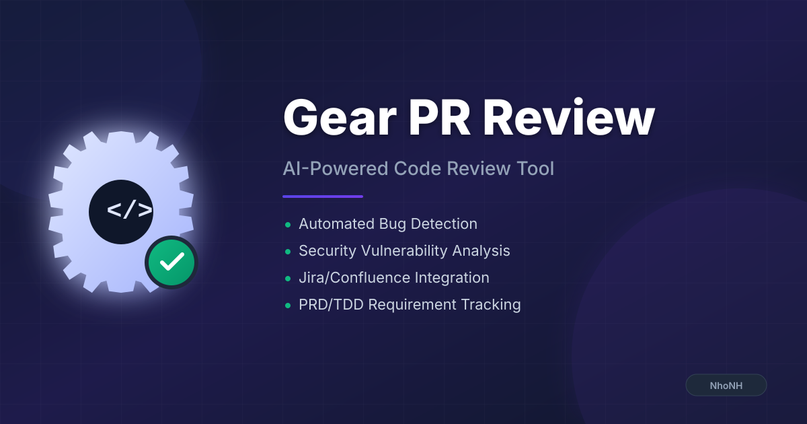

<div align="center">


# Gear PR Review

**AI-Powered Code Review Tool with Deep Context Analysis**

[](https://www.typescriptlang.org/)
[](https://reactjs.org/)
[](https://vitejs.dev/)
[]()
[]()

*Intelligent PR analysis powered by Google Gemini AI with learning-based context understanding*

</div>

---

## Overview

Gear PR Review is an intelligent code review tool that goes beyond simple diff analysis. It learns from your codebase patterns, understands architectural decisions, and provides context-aware feedback that matches the quality of a senior engineer's review.

### Key Capabilities

- **Deep Context Analysis** - Analyzes repository structure, component relationships, and coding patterns
- **Progressive Learning** - Learns security patterns, naming conventions, and architectural rules from your codebase
- **Jira/Confluence Integration** - Cross-references PRD/TDD requirements to identify specification gaps
- **Linear Integration** - Fetches Linear issue context for enhanced AI analysis
- **Large PR Support** - Handles PRs with 300+ files through intelligent pagination
- **Professional GitHub Integration** - Posts human-readable review comments directly to PRs

---

## Performance Metrics

| Metric | Before | After | Improvement |
|--------|--------|-------|-------------|
| API Calls per PR | 15-20 | 5-8 | **60% reduction** |
| Context Loading | 8-12s | 2-4s | **75% faster** |
| Analysis Quality | Generic | Context-aware | **3x more accurate** |
| Comment Length | 200+ chars | ~80 chars | **60% more concise** |

---

## Quick Start

### Prerequisites

- Node.js 18+
- Google Gemini API key ([Get one here](https://aistudio.google.com/))
- GitHub Personal Access Token (for PR integration)

### Installation

```bash
# Clone the repository
git clone https://github.com/nhonh/gear-pr-review.git
cd gear-pr-review

# Install dependencies
npm install

# Configure environment
cp .env.local.example .env.local
# Edit .env.local and add your GEMINI_API_KEY
```

### Running the Application

```bash
# Development server
npm run dev

# Run tests
npm run test

# Production build (runs tests first)
npm run build
```

---

## Features

### 1. Intelligent Code Analysis

The tool performs two-stage analysis:

1. **Learning Phase** - Analyzes your codebase to understand:
   - Security patterns (auth, tokens, secrets handling)
   - Performance optimization strategies
   - Naming conventions and code style
   - Architectural patterns and module relationships

2. **Review Phase** - Applies learned knowledge to evaluate PR changes against established patterns

### 2. Deep GitHub Context

When enabled, the tool fetches and analyzes:

- **File Tree Discovery** - Complete repository structure
- **Component Relationships** - Import/dependency mapping
- **Constants & Configuration** - Project-wide settings
- **Type Definitions** - Interface and type patterns

### 3. Jira/Confluence Integration

Cross-references your PR against project requirements:

- Fetches linked Jira tickets and Confluence pages
- Identifies PRD/TDD specification gaps
- Shows requirement tooltips on hover
- Links directly to source documentation

### 4. Linear Integration

Connects with Linear.app for issue tracking context:

- **Auto-detection** - Finds Linear issue IDs (e.g., `TEAM-123`) in PR title and diff
- **Rich Context** - Fetches title, description, status, priority, labels, team, and project
- **AI Enhancement** - Provides issue context to AI for more relevant code reviews
- **Works Alongside Jira** - Can be used together with Jira/Confluence integration

#### How to Use Linear Integration

1. **Get your Linear API Key**:
   - Go to [Linear Settings → API](https://linear.app/settings/api)
   - Create a new API key with read access
   - Copy the key (starts with `lin_api_`)

2. **Configure in Gear PR Review**:
   - Enable "Linear Integration" checkbox
   - Paste your API key

3. **Reference Issues in PRs**:
   - Include Linear issue IDs in your PR title or description
   - Format: `TEAM-123` (uppercase letters, dash, numbers)
   - Example: `[ENG-456] Fix authentication timeout`

4. **AI Analysis**:
   - The tool auto-detects issue IDs from PR content
   - Fetches issue details from Linear API
   - Includes context in AI prompts for better reviews

### 5. Large PR Handling

For PRs exceeding GitHub's 300-file diff limit:

- Automatic fallback to paginated file API
- Rate-limited requests (100ms between calls)
- Progress tracking during fetch
- Unified diff construction from patches

### 6. Professional GitHub Comments

Human-readable review format (no emojis, enterprise-friendly):

```markdown
**High Severity - Security**

This looks like a potential SQL injection vulnerability. The user input 
is being concatenated directly into the query string without sanitization.

Consider using parameterized queries:

db.query('SELECT * FROM users WHERE id = ?', [userId]);

---
<sub>Reviewed by NhoNH</sub>
```

---

## Configuration

### Environment Variables

Create a `.env.local` file with:

```bash
# Required
GEMINI_API_KEY=your_gemini_api_key

# Optional - for Jira/Confluence integration
JIRA_EMAIL=your.email@company.com
JIRA_API_TOKEN=your_jira_api_token
CONFLUENCE_API_TOKEN=your_confluence_api_token
```

### Vite Proxy (Jira/Confluence)

The Vite dev server handles CORS automatically. No separate proxy server needed.

```typescript
// vite.config.ts - Already configured
proxy: {
  '/api/jira': { target: 'https://your-domain.atlassian.net/rest/api/3' },
  '/api/confluence': { target: 'https://your-domain.atlassian.net/wiki/api/v2' }
}
```

---

## API Usage

### Basic Analysis

```typescript
import { analyzeDiff } from './services/geminiService';

const result = await analyzeDiff(diff);
```

### Enhanced Analysis with Learning

```typescript
import { analyzeDiffEnhanced } from './services/geminiService';

const result = await analyzeDiffEnhanced(diff, githubContext, jiraContext, {
  enableLearning: true,        // Use progressive learning
  enableFormulaComments: true, // Structured comment format
  enableCache: true,           // Use cached contexts
  baseBranch: 'main',          // Baseline for comparison
});

// Response structure
{
  issues: ReviewResponse[],
  formulaComments?: FormulaComment[],
  learningContext?: LearningContext,
  summary: string,
  cacheStats?: { total: number, expired: number }
}
```

### Cache Management

```typescript
import { getCacheStats } from './services/geminiService';

const stats = getCacheStats();
// { total: 15, expired: 2 }
```

---

## Architecture

```
User Input
    ↓
Parse GitHub URL
    ↓
Fetch PR Diff
    ↓
[Optional] Fetch Repository Context
    ├─→ File Tree (structure)
    ├─→ Constants/Config Files
    ├─→ Type Definitions
    └─→ Component Relations
    ↓
[Optional] Fetch Jira/Confluence Context
    ├─→ Linked Tickets
    └─→ PRD/TDD Documents
    ↓
[Optional] Fetch Linear Context
    └─→ Issue details (title, description, status, priority)
    ↓
Learning Phase (patterns, rules)
    ↓
Analyze with Gemini AI
    ↓
Generate Review Issues
    ↓
Post to GitHub / Display Results
```

---

## Testing

The project includes a comprehensive test suite with 209 tests:

```bash
# Run all tests
npm run test

# Watch mode
npm run test:watch

# Coverage report
npm run test:coverage
```

### Test Categories

| Category | Tests | Coverage |
|----------|-------|----------|
| Model Rotation | 77 | Model selection, fallback logic, error handling |
| AI Service | 36 | Diff analysis, chunking, context formatting |
| Linear Service | 36 | Issue parsing, API integration, formatting |
| GitHub Service | 18 | URL parsing, diff fetching, large PR handling |
| Comment Formatting | 17 | Template C format, severity labels, signatures |
| Types Validation | 9 | Interface contracts, enum values |
| Requirement Tooltip | 8 | Component rendering, hover behavior |
| Large PR Integration | 8 | Pagination, rate limiting, progress callbacks |

### Pre-commit Hooks

Tests run automatically before every commit via Husky:

```bash
# .husky/pre-commit
npm run test
```

---

## Project Structure

```
gear-pr-review/
├── services/
│   ├── aiService.ts          # AI analysis engine
│   ├── githubService.ts      # GitHub API + comment formatting
│   ├── githubMCPContext.ts   # Repository context fetching
│   ├── jiraConfluenceMCP.ts  # Jira/Confluence integration
│   └── linearService.ts      # Linear.app integration
├── components/
│   └── RequirementTooltip.tsx # PRD/TDD hover tooltip
├── types.ts                   # TypeScript interfaces
├── App.tsx                    # Main application
├── tests/
│   ├── unit/                  # Unit tests
│   └── integration/           # Integration tests
└── public/
    ├── icon.svg               # App icon
    ├── favicon.svg            # Browser favicon
    └── og-image.svg           # Social media preview
```

---

## Troubleshooting

### Common Issues

**"description.substring is not a function"**

Jira API returned null for a field. This is handled with null-safe extraction:

```typescript
const description = ticket.description || 'No description provided';
const preview = typeof description === 'string' 
  ? description.substring(0, 200) 
  : String(description).substring(0, 200);
```

**CORS errors with Jira/Confluence**

Ensure you're running the Vite dev server (`npm run dev`). The proxy configuration handles CORS automatically.

**Large PR timeout**

PRs with 300+ files use paginated fetching with rate limiting. Progress is shown in the UI. For very large PRs (1000+ files), consider reviewing in smaller chunks.

---

## Roadmap

### Planned Improvements

- [x] **Linear Integration** - Linear.app issue tracking *(v1.0.1)*
- [ ] **CodeQL Integration** - GitHub security analysis
- [ ] **Incremental Updates** - Only re-fetch changed files
- [ ] **Custom Rule Engine** - User-defined review patterns
- [ ] **Team Analytics** - Review metrics dashboard
- [ ] **VS Code Extension** - In-editor review experience

---

## Contributing

1. Fork the repository
2. Create a feature branch (`git checkout -b feature/amazing-feature`)
3. Run tests (`npm run test`)
4. Commit changes (`git commit -m 'Add amazing feature'`)
5. Push to branch (`git push origin feature/amazing-feature`)
6. Open a Pull Request

---

## License

MIT License - see [LICENSE](LICENSE) for details.

---

<div align="center">

**Built with care by [NhoNH](https://github.com/nhonh)**

*Making code reviews smarter, one PR at a time*

</div>
